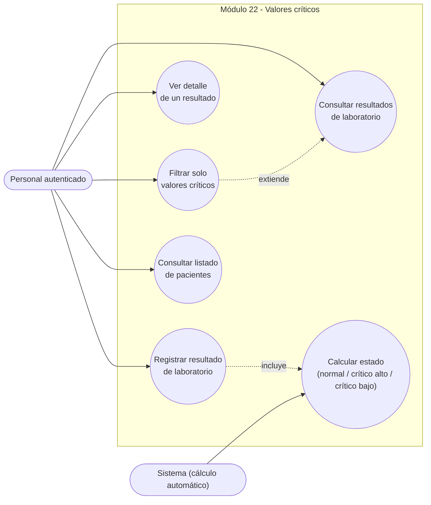
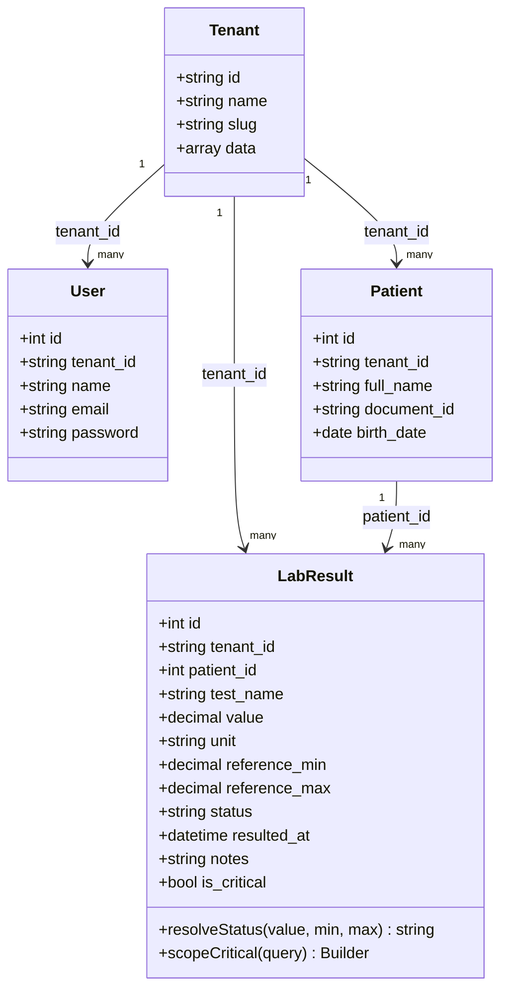
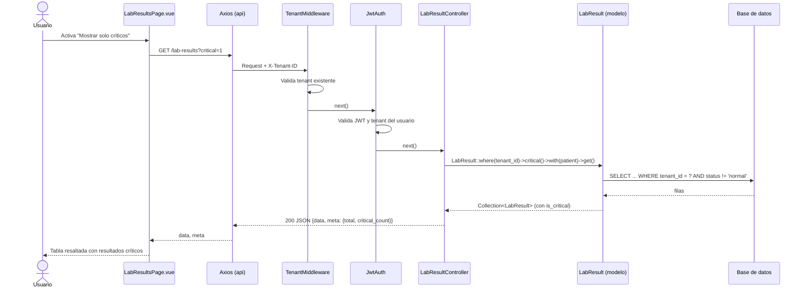
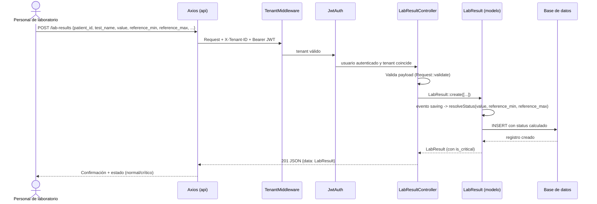

# Sprint 3 — Diagramas UML del módulo 22 (Valores críticos)

**Estudiante:** José Pablo Carías Flores (carné 1890-23-7587)
**Módulo:** N.º 22 — Valores críticos (indicador/alerta para resultados de laboratorio fuera de rango)

Estos diagramas están escritos en sintaxis **Mermaid**. GitHub los renderiza automáticamente al ver este archivo en el repositorio. Para el documento de Word, se pueden exportar como imagen usando [mermaid.live](https://mermaid.live) (pegar el bloque de código y exportar PNG/SVG).

---

## 1. Diagrama de casos de uso

Actor principal: **Personal autenticado** (Médico, Enfermera, TecnicoLab, Admin, Recepcionista — cualquier usuario del tenant con JWT válido). El sistema calcula automáticamente el estado crítico, por lo que también se representa como actor secundario.



---

## 2. Diagrama de clases

Incluye las entidades relevantes para el módulo: `Tenant`, `User`, `Patient` y `LabResult`. Se destaca la lógica de cálculo del estado crítico dentro de `LabResult`.



**Regla codificada en `LabResult::resolveStatus()`** (se ejecuta en el evento `saving` del modelo):

```
value < reference_min  => status = "critico_bajo"
value > reference_max  => status = "critico_alto"
en otro caso            => status = "normal"
is_critical = (status != "normal")
```

---

## 3. Diagramas de secuencia

### 3.1 Consultar valores críticos (`GET /api/v1/lab-results?critical=1`)



### 3.2 Registrar un resultado de laboratorio (`POST /api/v1/lab-results`)



---

## 4. Resumen para el documento de entrega

| Diagrama | Qué muestra |
|----------|-------------|
| Casos de uso | Acciones del personal autenticado sobre el módulo 22 y el cálculo automático del estado crítico. |
| Clases | Entidades `Tenant`, `User`, `Patient`, `LabResult` y la lógica de `resolveStatus()` / `is_critical`. |
| Secuencia (consulta) | Flujo completo de filtrado de valores críticos desde la vista Vue hasta la base de datos. |
| Secuencia (registro) | Flujo de creación de un resultado y cómo se asigna automáticamente el estado crítico. |
